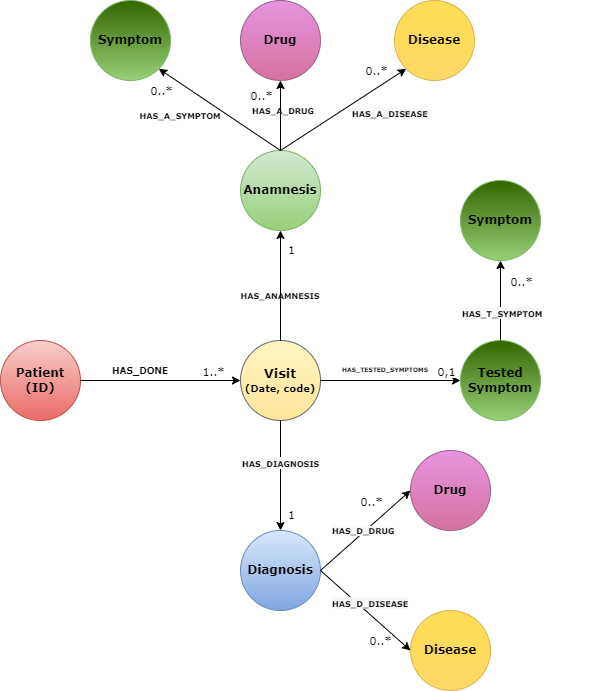

# Improving-Biomedical-Knowledge-GraphEmbeddings-with-Entity-Linking

This repository contains all the steps necessary for the creation of a biomedical knowledge graph and the subsequent improvement through an entity linking model. The results will be evaluated on the link prediction task downstream of heterogeneous graph representation learning.


# Index


- [How to start](#how-to-start)
- [Data preprocessing](#data-preprocessing)
- [From schema to Neo4j Biomedical Knowledge Graph](#From-schema-to-Neo4j-Biomedical-Knowledge-Graph)
- [Disease entity normalization with Entity Linking model](#Disease-entity-normalization-with-Entity-Linking-model)
- [Biomedical Knowledge graph enrichment](#biomedical-knowledge-graph-enrichment)
- [Heterogeneous Graph Representation Learning](#heterogeneous-graph-representation-learning)


# How to start

## Requirements

* Python 3.6+
* [neo4j](https://github.com/neo4j/neo4j) 
* [pytorch](https://github.com/pytorch/pytorch)
* [tqdm](https://github.com/tqdm/tqdm)
* [pytorch-transformers](https://github.com/huggingface/transformers)
* [numpy](https://github.com/numpy/numpy)
* [matplotlib](https://github.com/matplotlib/matplotlib)


# Data preprocessing 

Starting from the raw data contained within relational data models, for example:

```
Cardiopatia ischemica in follow up. Attualmente buon compenso emodinamico. Si consiglia eseguire una dieta ipocalorica. 
```

The unstructured text was divided into tokens, and each token was assigned a label among: B-Disease, I-Disease, B-Symptom, I-Symptom, O; according to the IOB-tags scheme with the help of domain experts. Through a fine-tunend BERT-base NER model it will be possible to predict labels for a given test set. The resulting file can be represented in JSON format or stored in a dataframe via the pandas library. For more details see in the `input` folder, in particular through the `Dataframe.pkl` and `graph_data.json` files.


# From schema to Neo4j Biomedical Knowledge Graph



If the input data is in JSON format, run the following script:

```
python source/load_visita_card_neo4j.py
```

Otherwise if the data is stored within a dataframe, run the following script:

```
python source/load_visita_ecg_neo4j.py
```

# Disease entity normalization with Entity Linking model

Through an entity linking model it is possible to obtain for each mention (to which the B-Disease or I-Disease tag is associated) the corresponding entity in a target knowledge base (DBpedia in our case).

The results of the entity linking task must be stored in a JSON with the following structure:

```
[
    {
        "mention": "ipertrigliceridemia",
        "entity": "Ipertrigliceridemia",
        "entity_number": "D015228",
        "entity_descr": "Per ipertrigliceridemia in campo medico, si intende un quantitativo abnorme di trigliceridi nel circolo sanguigno.",
        "entity_spec": "Endocrinologia"
    },
    {
        "mention": "insufficienza mitralica severa",
        "entity": "Insufficienza mitralica",
        "entity_number": "D008944",
        "entity_descr": "Per insufficienza mitralica o rigurgito mitralico, si intende il manifestarsi del reflusso di sangue dal ventricolo sinistro all'atrio sinistro, dovuto ad un'anomalia che determina un'imperfetta coaptazione dei lembi mitralici durante la sistole ventricolare.",
        "entity_spec": "Cardiologia"
    }
]
```

By running the following script it is possible to normalize the Disease entities in the biomedical knowledge graph:

```
python source/Entity_normalization.py
```

# Biomedical Knowledge graph enrichment

To enrich the knowledge graph with external information obtained from DBpedia, run the following script:

```
python source/enrichment.py
```

# Heterogeneous Graph Representation Learning

Using cypher query, extract all nodes and links from the linked biomedical knowledge graph.

```
MATCH (a)-[r]-(b)
WHERE id(a) < id(b)
return id(a), id(b) , type(r) , 1
```

```
MATCH(n)
RETURN id(n),replace(COALESCE(n.name, ""), " ", "_"), labels(n)[0]
```

In this way it will be possible to obtain all the information necessary to be able to execute the code released in the [HNE](https://github.com/yangji9181/HNE) repository. For more details, click [here](https://github.com/yangji9181/HNE).
